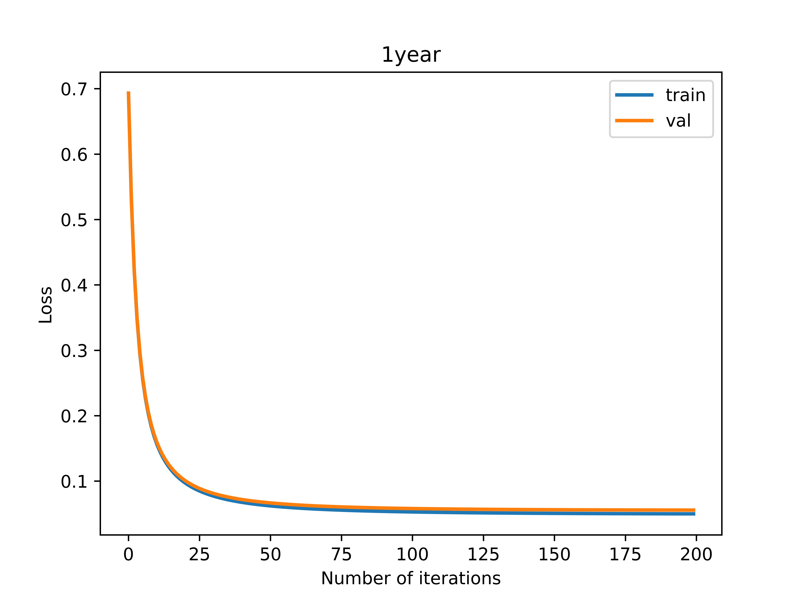
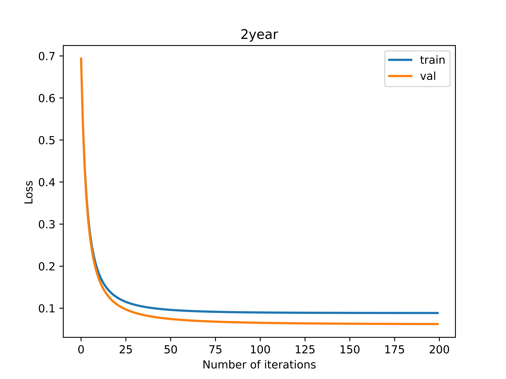
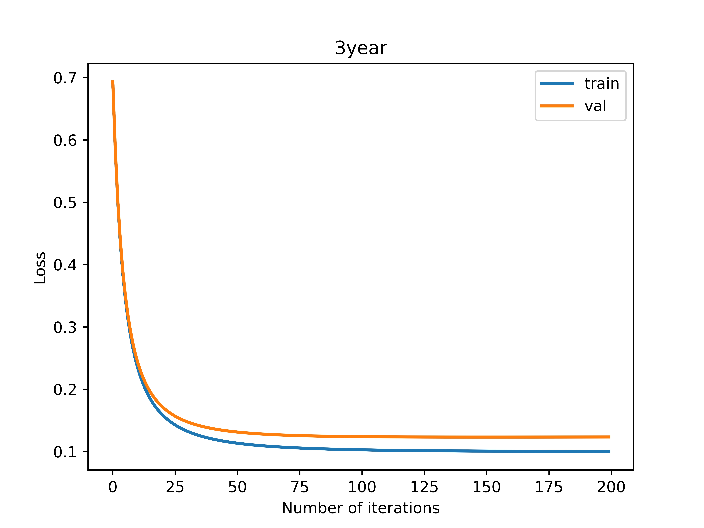
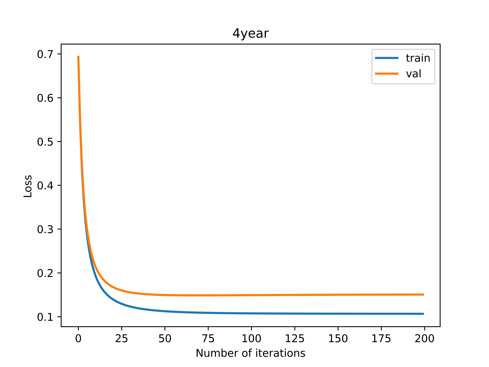
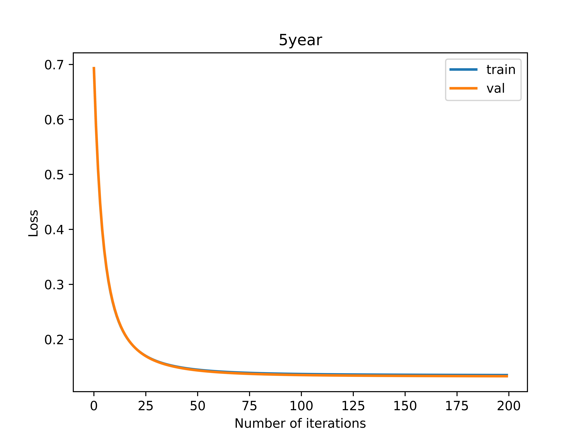

## DataMiningHW2

### logistic regression results

| dataset | acc | ROC_AUC | PR_AUC | F1_score |
| :------ | :----: | :------: | :------: | :------: |
| 1year | 0.988 | 0.5 | 0.012 | 0.497 |
| 2year | 0.979 | 0.5 | 0.021 | 0.495 |
| 3year | 0.973 | 0.5 | 0.027 | 0.493 |
| 4year | 0.967 | 0.5 | 0.033 | 0.492 |
| 5year | 0.966 | 0.5 | 0.034 | 0.491 |

### loss function changes during iterations

